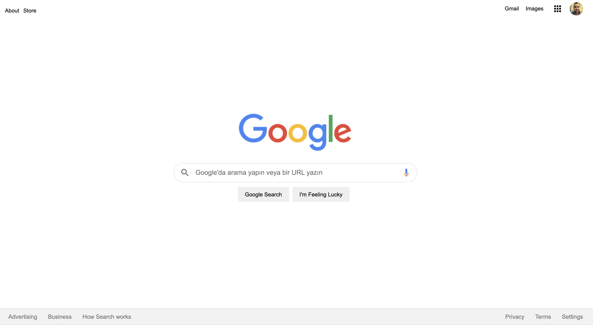

## Installation
Öncelikle projeyi clonelayın.

`https://github.com/sinanbarutcu/google-homepage.git`

## Usage
Projeyi cloneladıktan sonra Visual Studio Code programında açınız.

Linux için:

````
cd kodluyoruzilkrepo
code .
````

## License

[MIT](https://choosealicense.com/licenses/mit/)

